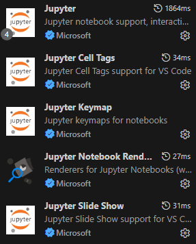
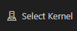

# Dynamic Programming - Sistema de Rotas para o Metrô

## 🧠 1. Descrição

Este projeto consiste no desenvolvimento de um **sistema de rotas para metrôs** utilizando **Python e Programação Dinâmica**, modelando redes urbanas como **grafos ponderados**. 

A aplicação calcula o **menor caminho (com memoização)** e o **maior caminho simples (com backtracking)** entre estações, considerando **variações de custo por horário** (bônus e penalidades). 

O objetivo é explorar conceitos como:

* Grafos e algoritmos de busca
* Recursão com memoização
* Análise de desempenho (tempo e memória)
* Simulação de cenários reais de mobilidade urbana 

---

## 🧱 2. Estrutura do Projeto

```
Checkpoint_2_em_grupo/
├── src/
│   ├── graphs/                     # Definição dos grafos
│   │   └── redes.py
│   │
│   ├── algorithms/                 # Lógica dos algoritmos
│   │   └── rotas.py
│   │
│   ├── visualization/              # Mapas e gráficos
│   │   └── grafos_e_mapas.py
│   │
│   ├── services/                   # Relatórios
│   │   └── relatorios.py
|   |
│   ├── main.py                     # Testa tudo
│   │
│   └── data/
│   │   └── outputs/                # Arquivos dos testes gerados
│   │      ├── metro_grafo_*.png
│   │      └── metro_mapa_*.html
│
├── .gitignore
├── notebook.ipynb                  # Notebook final
├── metro_grafo_*.png               # Arquivos do notebook gerados
├── metro_mapa_*.html
├── README.md
└── requirements.txt
```

---

## ▶️ 3. Como executar

1. Acesse o link do projeto no Google Colab ou clone o repositório e siga os demais passos:

[Google Colab](https://colab.research.google.com/drive/1hS9LZwSfH9tA9Ja9D9LDpglmhq3dNihK?usp=sharing)

ou

```bash
git clone https://github.com/gabsakura/Checkpoint-Dynamic
```

2. Acesse a pasta do projeto:

```bash
cd Checkpoint-Dynamic
```

3. Instale as dependências:

```bash
pip install -r requirements.txt
```

4. Verifique se você tem as extensões a seguir (se não, instale):



5. Selecione o Kernel (recomendado Python 3.13.3) que aparece no canto direito do arquivo ipynb para executar o código:



6. Execute cada célula do notebook (o ícone aparece na esquerda de cada célula de código):


---

## 👥 Integrantes

| Nome                                  | RM     |
|---------------------------------------|--------|
| Gabriel Alexandre Fukushima Sakura    | 99522  |
| Henrique de Oliveira Gomes            | 566424 |
| Henrique Kolomyes Silveira            | 563467 |
| Lucas Henrique Viana Estevam Sena     | 566246 |
| Matheus Santos de Oliveira            | 561982 |

---

## 📜 Licença

Este projeto é de uso acadêmico e educacional.